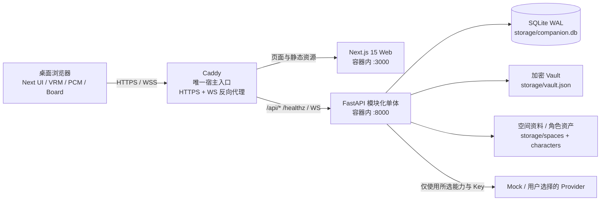
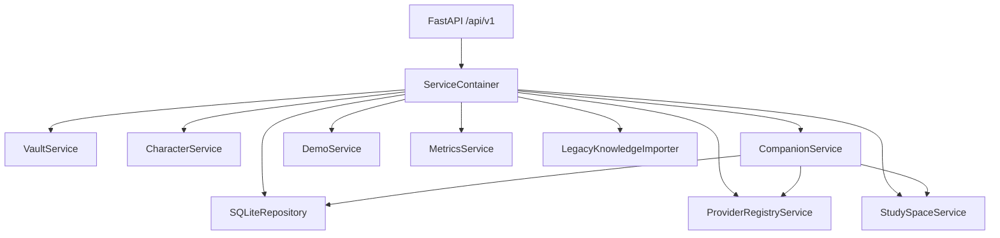
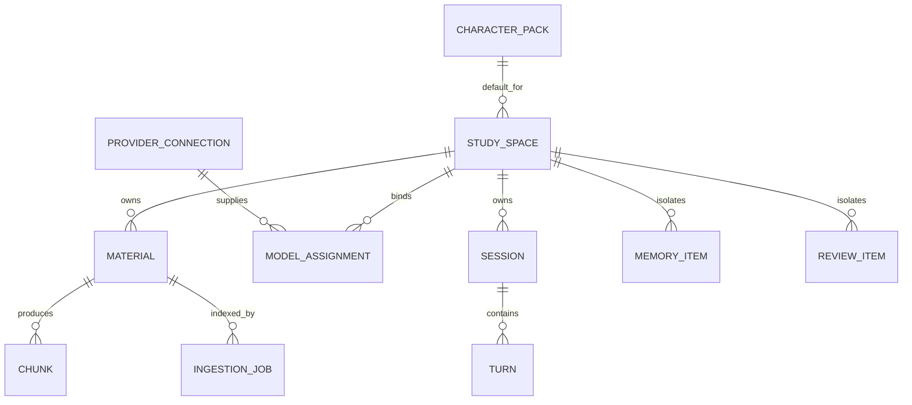
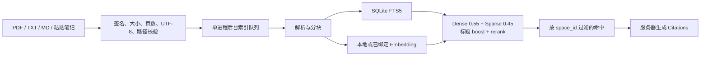
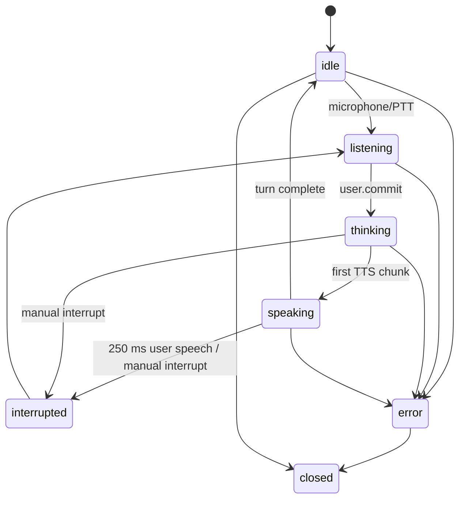

# Companion Space v0.1 整体架构规划与 Windows 接手手册

> **2026-08-18：** 日常接手请先读 [docs/handoff.zh-CN.md](handoff.zh-CN.md)。本文最后核对日是 2026-08-06，其中「Web 仍编成绝对域名、Docker 已是最新、功能基线 commit」等结论可能已过时。

> 文档定位：这是换机、接手和继续开发时的第一入口。它描述的是产品目标、当前真实实现、关键边界、Windows 运行方法和下一步优先级；不取代逐条开发任务与验收清单。

| 项目 | 当前值 |
| --- | --- |
| 产品 | 本地单用户、自托管、开源的二次元伴学空间 |
| 版本 | v0.1 本地发布候选版 |
| 功能基线 | `275a9e4`；文档所在版本以 `git rev-parse HEAD` 为准 |
| 运行基线 | Node.js 24、Python 3.13、Docker Desktop + Compose |
| 默认入口 | `https://companion.localhost` |
| 数据目录 | `storage/` |
| 当前发布结论 | `LOCAL RELEASE CANDIDATE — NOT FULLY SIGNED OFF` |
| 最后核对日期 | 2026-08-06 |

## 1. 先读这一页

Companion Space 不是“AI 老师”，也不是固定学科问答工具。前台是用户自己选择或捏制的可爱、cool 二次元专属搭子；学习诊断、解释、追问、引用和复习在对话背后自然发生。

v0.1 的完整用户闭环是：

```text
解锁本地 Vault
→ 使用 Mock 或接入自己的模型 Key
→ 创建学习空间
→ 导入个人资料
→ 创建/选择二次元角色
→ 开始文字或实时语音通话
→ 查看板书、演示与引用
→ 结束会话并编辑复盘
→ 确认记忆候选和复习项
```

当前代码已经能用 Mock 完成这条闭环，也已经通过本机自动化、Docker、长时通话和 Ollama 验证。真实 OpenAI-compatible、Anthropic、Gemini、ElevenLabs 凭据，物理麦克风/扬声器/蓝牙耳机和桌面 Edge 尚未完成最终手工验收，所以不能把当前版本称为完全签核的正式版。

下一台 Windows 电脑若只想先跑起来，直接看[第 15 节](#15-windows-换机与启动手册)；若要继续开发，从[第 16 节](#16-接手后的前-30-分钟)开始。

## 2. 文档的权威顺序

遇到冲突时按以下顺序判断：

1. [`AGENTS.md`](../AGENTS.md)：仓库纪律、安全红线、验证命令和许可约束。
2. [`docs/plan/v0.1-execution-plan.md`](plan/v0.1-execution-plan.md)：M0→M7 的范围、顺序与里程碑门槛。
3. [`docs/v0.1-acceptance.md`](v0.1-acceptance.md)：用户闭环、失败回退、指标和发布否决条件。
4. 当前代码、自动化测试、[`docs/release/v0.1-evidence.md`](release/v0.1-evidence.md) 和 [`docs/release/v0.1-manual-matrix.md`](release/v0.1-manual-matrix.md)：代码与测试说明“实际上实现了什么”，evidence 记录自动化与发布结论，manual matrix 记录逐场景人工/外部门禁状态与缺口。
5. 本文：架构总览、接手说明和跨机运行指南。

执行方案第 2 节是“开工前现状勘察”，其中部分数字和能力描述已经成为历史，不能再当作当前实现。若文档和代码不一致，先以测试过的代码为事实，再修正文档，不要为了迁就旧文字倒退实现。

## 3. 产品规划基线

### 3.1 用户与核心任务

目标用户是希望把自己的资料、模型和喜爱的二次元形象组合成私人学习环境的本地拥有者。核心任务包括：

- 我想把零散 PDF、Markdown、TXT 和笔记放进独立学习空间，并能追溯回答依据。
- 我想自由选择模型厂商，不把 API Key 交给项目方或浏览器存储。
- 我想让一个有个性、有声音、有状态反馈的二次元角色陪我学习，而不是面对传统“老师面板”。
- 我想在通话后获得可编辑的字幕、摘要、记忆和复习项，而不是让一次对话直接消失。
- 即使模型、麦克风、语音或 3D 渲染失败，我仍然要能知道原因并继续用文字完成学习。

### 3.2 v0.1 范围

- Apache-2.0、本地单用户、自托管。
- 同一台电脑的桌面浏览器访问。
- Mock 全链路；BYOK Provider Registry 和按空间能力绑定。
- PDF、TXT、Markdown、粘贴笔记；SQLite FTS5 + 本地混合检索。
- 浏览器本地 VRM 1.0 渲染和 2D 回退，不上传摄像头画面。
- 文字流和单 WebSocket 实时音频通话。
- 服务端真实命中引用、板书、分步演示、复盘、记忆候选和复习项。
- 默认不持久化原始音频。

### 3.3 v0.1 明确不做

- 公共云账号、多用户协作、跨设备云同步。
- v0.1 历史发布不包含手机/LAN 配对；当前仓库已经以增量移动端切片实现
  一次性配对、受信设备撤销、Android Keystore / iOS Keychain 和短期访问
  凭据，但公开域名/证书、商店签名与真机发布仍是部署门。
- WebRTC、用户摄像头理解、真人数字人、服务端视频渲染。
- 专业网格建模、AI 生成 3D、Live2D/Cubism。
- DOCX、EPUB、网页抓取、OCR、音视频资料索引。
- 完整离线模型安装包、自动课程生成、知识图谱。
- 多进程后台队列、Redis、Celery、PostgreSQL、外置向量库。

### 3.4 成功与否怎么判断

发布不是按“页面数量”判断，而是按闭环和失败回退判断：

- 全新克隆不使用真实 Key，可用 Mock 完成空间→资料→角色→通话→引用→复盘→记忆。
- 空间 A 的资料、会话、记忆、复习和模型绑定不能进入空间 B。
- 明文 Key 不落 SQLite、日志、前端响应、导出物或 Git。
- Citations 只能来自服务器的真实检索命中。
- 通话结束后磁盘、SQLite 和日志中没有原始音频。
- 缺少 STT/TTS、麦克风拒绝、WS 断线和 VRM 失败都有可见原因和确定回退。
- Mock 首段播放低于 800 ms；插话达到阈值后 250 ms 内停止本地播放；支持设备的角色渲染不低于 30 FPS。

## 4. 当前发布状态

截至功能基线 `275a9e4`，仓库证据记录为：

| 门禁 | 结果 |
| --- | --- |
| Ruff | PASS |
| 后端 Pytest | 268 passed，7 个上游弃用警告 |
| TypeScript / ESLint / Next 15.5.22 build | PASS |
| Playwright | 14 passed，1 skipped |
| Mock 完整用户旅程 | PASS |
| Mock 首段延迟 | 546 / 494 / 609 ms，PASS |
| 硬件 VRM ≥30 FPS | PASS |
| 30 分钟实时通话 soak | PASS |
| npm / Python 依赖审计 | PASS |
| 安全审查 | APPROVE / LOW |
| Docker HTTPS 全栈 smoke | PASS |
| Ollama 0.32.5 + `deepseek-r1:1.5b` | PASS |
| 真实远程 Provider Key | NOT RUN |
| 真实麦克风、扬声器、蓝牙耳机 | NOT RUN |
| Desktop Edge | NOT RUN |

因此当前结论必须保持为：

```text
LOCAL RELEASE CANDIDATE — NOT FULLY SIGNED OFF
```

历史证据详见 [`docs/release/v0.1-evidence.md`](release/v0.1-evidence.md)。换机后的重新验证不能把历史摘要写成“本轮刚刚跑过”。

## 5. 架构原则与关键决策

1. **本地优先。** 学习资料和元数据以本机为权威；项目方没有云端账号或中转服务。
2. **空间是强隔离边界。** 资料、chunk、会话、turn、记忆、复习和模型能力绑定都必须带 `space_id`。
3. **能力显式绑定。** Chat、Analysis、Embedding、STT、TTS 分开绑定；未知或失败 Provider 不得静默切 Mock。
4. **密钥与业务数据分离。** Provider 元数据在 SQLite，Key 在单独加密 Vault；浏览器只拿短期 owner token。
5. **模型不拥有引用权。** 模型只产出回答；引用由服务器根据真实命中片段生成。
6. **资料是不可信数据。** 文档指令不能改变系统角色、凭据、安全规则或空间边界。
7. **低延迟路径要短。** 通话中只做检索、回答和语音；摘要、记忆和复习在回合后异步生成。
8. **失败可见、功能可降级。** 语音失败退文字，3D 失败退 2D，但不得伪造成功或换厂商。
9. **浏览器渲染角色。** 服务端不生成视频流，只传状态、文字、PCM 和可选表情提示。
10. **模块化单体优先。** v0.1 不引入分布式基础设施；一个 FastAPI 进程、一个 SQLite、一个内存索引队列足够。

## 6. 运行时总体拓扑



Docker 模式下只有 Caddy 映射宿主机 `80/443`。Web 和 API 只在 Compose 内网 `expose`，不直接暴露宿主端口。Caddy 使用本地 CA 提供 HTTPS，并代理普通 HTTP、NDJSON 流和 WebSocket。

## 7. 仓库结构与责任边界

```text
.
├── apps/web/                 Next.js 15 + React 19 前端
│   ├── app/                  App Router 页面
│   ├── components/           业务 UI、实时通话、角色、板书
│   ├── lib/                  API 适配、DTO、owner session
│   └── public/assets/        内置角色等运行素材，不是缓存
├── services/api/             FastAPI 后端
│   ├── app/api/              REST / WebSocket 路由和依赖装配
│   ├── app/services/         业务服务与 sqlite3 仓储
│   ├── app/providers/        Provider 适配器
│   ├── app/rag/              解析、embedding、rerank
│   └── tests/                后端回归与安全边界测试
├── libs/                     Prompt 与 JSON Schema
├── infra/
│   ├── caddy/                HTTPS 入口、证书数据
│   └── docker/               API / Web 镜像
├── tests/e2e/                Playwright 用户闭环与性能测试
├── scripts/                  Docker smoke、审计与发布脚本
├── storage/                  本地运行数据，已 gitignore
├── docs/                     规划、架构、隐私、发布证据
├── docker-compose.yml
├── .env.example
└── AGENTS.md
```

不要把以下目录误删为“无用资源”：

- `apps/web/public/assets/characters/models`：约 54 MiB 的运行时 VRM 素材。
- `storage/`：SQLite、加密 Vault、资料和导入资产。
- `.git/`：完整版本历史和接手上下文。

可以重建的主要占用包括 `apps/web/.next`、根 `node_modules`、历史 `node_modules *`、`.venv*`、Playwright 缓存和旧归档包。

## 8. 前端架构

### 8.1 技术与页面

- Next.js 15.5.22、React 19.1、TypeScript 5.8、App Router。
- 不使用 Tailwind、全局状态库或请求框架；样式以全局 CSS 变量和少量 CSS Modules 为主。
- REST、NDJSON、下载和 DTO 适配集中在 `apps/web/lib/api.ts`。
- Owner token 只存在 `apps/web/lib/owner-session.ts` 的模块内存，不进入 localStorage、sessionStorage 或 Cookie。刷新页面后通常需要重新解锁。

| 路由 | 责任 |
| --- | --- |
| `/` | Vault、空间、Provider、角色和会话总览 |
| `/vault` | 初始化、解锁、锁定、重置凭据 |
| `/providers` | Provider 连接、测试、模型发现 |
| `/spaces` | 学习空间列表与创建 |
| `/spaces/[spaceId]` | 资料、索引任务、能力绑定、旧资料导入 |
| `/spaces/[spaceId]/call` | 文字/语音房间、角色、板书、演示 |
| `/characters` | 创建、导入、复制、导出角色 |
| `/characters/[characterId]` | 配方、声音和 VRM 预览 |
| `/sessions` | 会话聚合列表 |
| `/sessions/[sessionId]` | 字幕、引用、复盘、记忆、复习 |
| `/memory?spaceId=...` | 按空间确认、编辑和删除记忆 |
| `/review-items?spaceId=...` | 按空间维护复习项 |
| `/settings` | 本地指标、运行状态、成人关系开关 |

### 8.2 实时前端

`use-realtime-session.ts` 统一协调 REST 会话、一次性 WS ticket、麦克风、PCM 播放、字幕、打断和文字回退。连接顺序是：

1. 通过 REST 创建并核对真实 `session`。
2. 请求绑定 session、默认 90 秒有效的一次性 realtime ticket。
3. 使用 WebSocket 子协议 `companion-v1` 和 `ticket.<token>` 建连。
4. 收到 `session.open` 后再申请麦克风。
5. 断线停止媒体并结束旧 session；再次连接创建新 session，不续传旧音频。

WebSocket URL 必须包含 `:sessionId`，并且 host 必须与页面或 API host 一致。HTTPS 页面只允许 `wss`；非 localhost 的明文 `ws` 会被前端拒绝。

### 8.3 角色渲染

`AvatarRuntime` 动态加载 Three.js、React Three Fiber、`@pixiv/three-vrm` 和 `@pixiv/three-vrm-animation`。成功时在浏览器本地驱动 VRMA 身体动作、凝视、眨眼和 RMS 口型；WebGL、资源或 VRM 元数据失败时回退到 CSS 2D 人像。

当前“捏人”外观选项依赖内置模型的 mesh/material 命名映射。任意第三方 VRM 通常可以显示，但不保证发型、服装、配饰和调色全部生效。`CharacterRecipe.motions` 已接入真正的 VRMA 播放：项目内置四个由仓库脚本确定性生成、以 CC0 发布的 `idle/listening/thinking/speaking` 原地身体动作；每个 VRM 实例持有一个 `AnimationMixer`，状态切换使用短交叉淡化，缺失或加载失败的状态单独回到对应的程序化动作。系统“减少动态效果”开启时不加载 VRMA，并停用身体与视线运动，仅保留低频眨眼和语音口型。

共享的 `AvatarRuntime` viewport 还把主指针和触控位置归一化到 `[-1, 1]`，通过稳定 ref 交给现有 VRM LookAt target，不因高频移动触发 React 重渲染、Canvas 重挂载、模型重载或 VRMA action 重启。运行时在 `vrm.update()` 后读取真实 `VRMLookAt.yaw/pitch`；表达式型与骨骼型 LookAt 都使用同一公开契约。2D fallback 只平移眼睛，pointer leave/cancel、窗口失焦和非鼠标 pointer up 会复位。系统“减少动态效果”开启时输入、target、实际输出和 2D 眼睛都保持中心静止。该交互参考 AIRI 舞台的可配置 gaze 体验，但未复制 AIRI 代码、模型、动作、纹理或其他资产。

`CompanionTurn.emotion` 同时驱动 3D 与 2D 角色的语义表情。前后端只接受 `neutral/warm/cheerful/curious/focused/playful/concerned`；新用户轮次、PTT/VAD、打断、换会话、错误和结束会话会先复位为 `neutral`，只有通过当前空间与会话校验的最终回复才能重新设置情绪。VRM 运行时通过 `VRMExpressionManager.getExpression()` 读取模型元数据，只叠加非二元且 `overrideBlink/overrideMouth` 均为 `none` 的表情；未知、二元或会削弱眨眼/口型的候选均安全跳过，身体 VRMA 继续独立播放。减少动态效果时表情保持为静态低权重，身体和视线仍然静止。Seed-san 的内置情绪组均为二元表情，因此当前按安全策略无语义表情叠加，但眨眼和口型照常工作。

运行时只信任四个精确登记的内置动作 URL。角色包中的 `.vrma` 必须是 manifest 已声明且实际存在的安全相对路径，并通过 GLB、`VRMC_vrm_animation 1.0`、完整 humanoid 映射、内嵌 animation buffer 和纯 rotation/in-place 子集校验；浏览器通过带 Owner token 的资产 API 下载后只把临时 `blob:` URL 交给渲染器，卸载角色时立即撤销。旧配方里的 `breathe`、`lean-in` 等程序化 token 继续兼容，但不会被误当作文件请求。

角色编辑器还允许 Owner 为 `idle/listening/thinking/speaking` 四个状态分别上传或移除一个本地 `.vrma` 覆盖。服务端只接受通过同一 VRMA 校验器的原始字节，并写入内容寻址的 `managed-motions/{state}-{sha256}.vrma`；只有服务端生成、路径已列入 `asset_paths`、状态与 SHA-256 完全匹配的 `managed_motions` 条目才会覆盖配方动作。读取、头像替换/移除和复制前都会重新校验哈希；原生角色包不能声明保留命名空间。覆盖不改写 `CharacterRecipe`，会随头像替换、移除和角色复制保留；移除某槽后立即显露原配方动作或程序化回退。直接上传没有可验证的独立许可，因此只供本地运行，任一覆盖存在时阻止完整角色包导出。

Character Workshop 的 `Stage Companion` 是参考 [AIRI](https://github.com/moeru-ai/airi) 舞台式数字伴侣体验的社区预设，继续复用现有 React/Three.js 运行时和已登记为 CC0 的 Sendagaya Shino。它不包含 AIRI 的默认 VRM、Live2D、预览图或私有 Vue workspace 包，也不是 AIRI 官方角色；后续若要引入 AIRI 角色资产，必须先取得模型权利人的独立再分发授权。

Character Studio 同时接受独立的 Character Card V2/V3 `.json`，将有长度上限的角色描述、人格、场景、开场白和对话示例转为现有 CharacterPack 人格层。导入文本仍处于 `runtime_character_data` 的不可信数据边界；卡内 `system_prompt` 和 `post_history_instructions` 不执行、不持久化，`extensions`、远程图片和模型 URL 不下载。导入后仍由用户在本地选择已授权的 VRM/VRMA，因此兼容角色创作生态不会绕过现有资产许可和运行时信任边界。

Character Studio 还识别 AIRI `v0.11.3` 固定提交 `dbf812488829a61cc2e95909e021b215704d066c` 的角色卡 ZIP 契约：根目录必须是精确的 `manifest.json` 与 `card.json`，并声明 `airi-character-card`、容器版本 `1`、`chara_card_v3` 和卡片版本 `3.0`。官方白名单人格文本会进入既有不可信人格层；`system_prompt`、`post_history_instructions`、`extensions` 和未知字段仍被验证后丢弃。card-only 继续使用内置 VRM；声明 `vrm` 时只读取该单一成员，通过既有 VRM 0.x/1.0 与内嵌元数据许可校验后规范化为受保护的 `model.vrm` 和 `licenses/vrm-meta.json`。声明 `live2d-zip` 或 `spine-zip` 时，服务端对外层成员和内层归档分别执行成员数、解压大小、路径、碰撞、符号链接、加密、元数据引用与 SHA-256 校验，再仅以 `display-model/model.zip` 和本地许可事实保存；资产标记为 `local_only`、`rights_verified=false` 且不可导出。浏览器不会把这些 ZIP 误交给 VRM loader，也不会静默换成内置角色，而是只把受保护 Blob 交给同源、协议匹配、由许可持有人提供的运行时 bridge；bridge 未配置或失败时明确阻止形象渲染，文字会话和已锁定的角色人格保持可用。外层 AIRI manifest 不能覆盖模型自身或本地导入边界的许可事实，导入也不会自动改写空间默认角色或既有会话。兼容性证据来自按固定上游源码编写的 clean-room 合同夹具，不声称已执行 AIRI 官方导出器，也不包含 AIRI 角色、模型、纹理、专有运行时或动作资产。

`CharacterRecipe.avatar_framing` 持久化角色的舞台取景，只允许 `full_body` 和 `portrait`；旧配方缺少该字段时按 `full_body` 读取。运行时在模型加载或外观网格变化后测量可见 Mesh，并结合 humanoid 肩、头、髋和脚部标记计算真实 R3F 相机的目标、距离与占用率；切换取景或调整 Canvas 尺寸只重算相机数学，不重新请求模型或遍历包围盒。无效或异常尺寸会安全回退到旧的确定性相机参数。

`CharacterRecipe.stage_background` 持久化 `neutral/study/midnight` 三种纯本地舞台背景；旧 SQLite 记录、旧角色包和旧独立配方缺少字段时均按 `neutral` 读取，并精确保留升级前的默认渐变。`Stage Companion` 使用 `portrait + midnight`。背景只通过 `AvatarRuntime` 的共享 viewport CSS 绘制，因此透明 3D Canvas 与 WebGL 失败后的 2D fallback 使用同一选择；切换背景不会重建 Canvas、重新加载 VRM、重新测量模型或请求远程资源。该能力是参考 AIRI 舞台环境交互的 clean-room 实现，不包含 AIRI 图片、场景、模型或代码。

### 8.4 当前前端维护风险

- `apps/web/lib/api.ts` 和 `use-realtime-session.ts` 均接近两千行；先锁定契约与状态机再拆分，不能直接“整理代码”。
- 总览和部分会话聚合仍使用全有或全无的 `Promise.all`，空间多时有 N+1 请求风险。
- 没有全局 React ErrorBoundary、`error.tsx`、`loading.tsx` 或 `not-found.tsx`。
- 性能/soak npm 脚本使用 POSIX 环境变量语法，原生 PowerShell 不可直接运行。

## 9. 后端架构

后端是单进程、模块化单体。`ServiceContainer` 在进程内装配并复用服务：



| 服务 | 责任 |
| --- | --- |
| `SQLiteRepository` | 裸 `sqlite3`、建表、轻量迁移、FTS5、事务 |
| `VaultService` | KDF/加密、Owner 会话、WS ticket、锁定失效 |
| `ProviderRegistryService` | 连接、能力、模型发现、适配器解析、Base URL 安全 |
| `StudySpaceService` | 空间、资料、单线程索引、混合检索 |
| `CharacterService` | 角色 CRUD、VRM/zip、许可和路径校验 |
| `CompanionService` | 状态机、Prompt、RAG、LLM 流、引用、复盘 |
| `DemoService` | 分步 LessonScript |
| `MetricsService` | 只接受白名单字段的本地指标 |
| `RealtimeConnection` | 每条 WS 的内存音频和活动回合互斥 |

只支持一个 Uvicorn worker。SQLite 写入、单个内存索引线程和复盘恢复扫描都没有跨进程 lease；不要通过 `--workers N`“提升性能”。启用多 worker 前必须先为后台任务增加数据库原子 claim/lease。

本地指标的事件名、分组和 payload 白名单以 `services/api/app/services/metrics.py` 为准。新增或修改指标时，必须同步核对 `ACTIVATION_EVENTS`、`RELIABILITY_EVENTS`、`QUALITY_EVENTS`、`PERFORMANCE_EVENTS` 和 `_EVENT_KEYS`；否则 `MetricsService.record_event_safe()` 只会记录 warning 并丢弃该事件，不能把“调用过打点函数”当成指标已入库。

## 10. 数据架构与空间隔离

### 10.1 持久化位置

```text
storage/
├── companion.db             SQLite 元数据、FTS、字幕、复盘
├── vault.json               加密 Provider 密钥
├── spaces/{space_id}/
│   └── materials/           原始学习资料
├── characters/              导入角色资产
├── knowledge_base/          旧原型资料，只读迁移来源
└── model_cache/             可选本地模型缓存
```

SQLite 初始化时开启并校验 `journal_mode=WAL`，每次连接开启 `foreign_keys=ON`、配置原生 timeout 与 `PRAGMA busy_timeout`。当前没有 SQLAlchemy、Alembic 或连接池；`PRAGMA user_version=1` 是迁移版本源，v0→v1 在单一 `BEGIN IMMEDIATE` 事务中完成，未来版本在任何持久化修改前 fail closed。

### 10.2 实体与作用域



当前 15 张应用表为：

`study_spaces`、`materials`、`chunks`、`ingestion_jobs`、`character_packs`、`provider_connections`、`model_assignments`、`sessions`、`turns`、`memory_items`、`review_items`、`owner_sessions`、`owner_preferences`、`local_metric_events`、`realtime_tickets`。

另有 FTS5 虚表 `chunks_fts` 和 SQLite shadow tables。

作用域规则：

- `ProviderConnection` 和 `CharacterPack` 是全局可复用资源。
- `ModelAssignment` 必须按 `space_id + capability` 绑定。
- Material、Chunk、Job、Session、Turn、MemoryItem、ReviewItem 全部限制在一个空间。
- FTS 同时在虚表和主表过滤 `space_id`。
- 客户端还会复核响应的 `space_id`，但服务端/数据库边界才是安全权威。

### 10.3 跨机迁移特别风险

自 2026-08-06 Windows 接手加固起，`materials.storage_path` 统一保存相对 `OBJECT_STORAGE_PATH` 的 POSIX key：

```text
spaces/{space_id}/materials/{material_id}.{ext}
```

`SQLiteRepository` 会在 ingestion worker 启动前，以单一 `BEGIN IMMEDIATE` 事务扫描旧库。只有旧 Mac、Windows、Docker 绝对路径的最后四段与素材 `space_id`、`material_id`、扩展名完全一致时才会 rebase；未知路径、`..`、错空间、错素材保持原值，并由统一 resolver 失败关闭。resolver 还会拒绝最终文件或任一父目录符号链接。

新写、跨 storage root、旧三平台绝对路径、幂等、事务回滚、删除恢复和 symlink 边界已有自动化回归。迁移仍应先停机备份；不要直接手工全库字符串替换，也不要在服务运行时复制 WAL 数据库。

## 11. API 与共享合同

### 11.1 REST

主前缀为 `/api/v1`，健康检查为 `/healthz`，OpenAPI 为 `/openapi.json`，交互文档为 `/docs`。

| 组 | 主要能力 |
| --- | --- |
| `/vault/*` | status、init、unlock、lock、reset、owner preferences |
| `/providers/*` | registry、连接 CRUD、模型发现、测试 |
| `/spaces/*` | 空间、目标、资料、索引任务、能力绑定 |
| `/characters/*` | 配方、复制、导入导出、资产、试听 |
| `/sessions/*` | 创建、文字流、WS ticket、演示、结束、复盘 |
| `/memory/*` | 确认、编辑、删除记忆 |
| `/review-items/*` | 编辑、删除、计划复习 |
| `/metrics/*` | 本地白名单指标 |

除初始化/解锁等引导接口外，核心资源需要 `Authorization: Bearer <owner-token>`。后端没有 Cookie 鉴权。

### 11.2 WebSocket

端点：

```text
/api/v1/sessions/{session_id}/realtime
```

统一事件形状：

```json
{
  "type": "llm.delta",
  "session_id": "...",
  "state": "thinking",
  "payload": {}
}
```

主要事件：`session.open`、`asr.partial`、`asr.final`、`llm.delta`、`llm.final`、`board.update`、`demo.ready`、`tts.chunk`、`turn.interrupted`、`heartbeat`、`error`。

需要注意：当前 `asr.partial` 只报告 `buffered_audio_bytes`，不是增量识别文字；真正字幕以 `asr.final` 为准。

### 11.3 CompanionTurn

核心回答合同包含 `display_text`、`spoken_text`、`emotion`、`citations`、`suggested_actions` 和 usage。不存在 `legal_answer` 或固定亲密话术。前端会验证 wire payload；服务端引用覆盖任何模型自报引用。

## 12. Provider、RAG 与学习引擎

### 12.1 Provider 能力矩阵

| Provider | Chat | Analysis | Embedding | STT | TTS |
| --- | --- | --- | --- | --- | --- |
| Mock | ✓ | ✓ | ✓ | ✓ | ✓ |
| OpenAI-compatible | ✓ | ✓ | ✓ | ✓ | ✓ |
| Anthropic | ✓ | ✓ | — | — | — |
| Gemini native | ✓ | ✓ | ✓ | — | — |
| ElevenLabs | — | — | — | — | ✓ |
| Ollama | ✓ | ✓ | ✓ | — | — |

新空间默认绑定 Mock 的 Chat、Analysis、STT 和 TTS，不默认绑定 embedding。切换到真实 Chat 后，不应保留未被用户明确确认的隐式 Mock 分析/语音绑定。任何能力缺失都显示原因，绝不静默跨厂商回退。

HTTPX Provider 的默认与自定义 Base URL 在保存和每次实际请求前都会校验，拒绝凭据 URL、元数据地址、无法解析的域名和非 Ollama 私网地址。每次操作使用一次不可变 DNS 地址快照，TCP 只连接已校验 IP，同时保留原 hostname 用于 TLS 证书校验、SNI 和 `Host`；重定向和环境代理关闭。Gemini 使用固定 Google SDK 端点，不属于自定义 URL 面。

### 12.2 资料导入和检索



- 默认上限 50 MiB、PDF 500 页、提取文本 2,000,000 字符。
- 仅支持可提取文本 PDF，不做 OCR。
- 索引任务入 SQLite，启动可恢复 pending/processing job。
- 默认配置名是 BGE，但默认 requirements 没有 `FlagEmbedding`；`ALLOW_ML_FALLBACK=true` 时实际使用确定性的 `LocalHybridEmbeddingProvider` 和本地排序，不会偷偷下载 BGE。
- 更换 embedding 模型后，旧索引 provenance 不匹配会 fail closed，需要重新索引。

### 12.3 Prompt 和三类检索池

每轮回答使用三个分开的池：

1. 当前空间资料命中；
2. 当前空间已确认的记忆；
3. 当前空间待复习项。

资料以“不可信 JSON 数据块”注入，不能充当系统指令。敏感记忆在拥有者明确确认前不能进入长期上下文。每轮完成后，后台再生成摘要、最多 3 条记忆候选和最多 3 个复习项。

复盘任务仍由进程内 `asyncio.create_task` 执行，但状态持久化到 SQLite。FastAPI lifespan 启动时会按更新时间扫描并恢复 `pending/running`：未结束会话只重建摘要，已结束会话同时重建候选记忆和复习项；`ready` 不会重复生成。生成任务以单并发串行执行，避免重启积压同时冲击 Provider。真实 Provider 的 Vault 尚未解锁时，任务回到 `pending` 且不记录假失败，解锁后继续；进程关闭会取消内存任务并保留可恢复状态。

## 13. 实时语音、角色和板书

### 13.1 状态机



音频合同：

- 上行：PCM16、单声道、16 kHz、20 ms、每帧 640 bytes。
- 单连接内存缓冲上限：120 秒。
- 默认 700 ms 静音提交，可调 400–1500 ms。
- 连续 250 ms 用户声音触发本地 barge-in。
- 下行：little-endian PCM16、单声道、24 kHz。
- 原始音频只在内存；结束/断线时清空，不写 SQLite、文件或日志。

### 13.2 回退策略

| 失败 | 用户看到的行为 |
| --- | --- |
| 无 WS URL / ticket 失败 / 断线 | 保留真实 session，明确切到文字模式 |
| 麦克风拒绝 | 显示原因，保留文字输入 |
| 未绑定 STT | 不伪识别，提示配置并保留文字 |
| 未绑定 TTS | 回答仍显示文字，角色不播放语音 |
| Provider 401/429/超时 | 显示当前 Provider 原因，不换厂商 |
| 模型输出格式错误 | 服务端拒绝无效结构并返回安全的文字错误状态，不生成虚假引用 |
| 演示脚本格式错误 | 服务端拒绝脚本并返回文字错误状态，不播放残缺演示、不生成虚假引用 |
| VRM/WebGL/资源失败 | 回退 2D 人像 |
| Mermaid 渲染失败 | 显示错误和原始板书文本 |
| 知识库为空 | 正常聊天，明确“未使用空间资料” |

### 13.3 板书和分步演示

板书支持 `mermaid`、`markdown`、`highlight`。Mermaid 在浏览器本地打包运行，使用严格安全模式并转为 Blob SVG；失败时保留原始文本。分步演示由 `analysis_llm` 生成并校验 3–8 步 `LessonScript`，每一步引用仍由服务器绑定真实资料命中。

## 14. 安全、隐私与许可红线

### 14.1 密钥链路

正常依赖安装下：

```text
主密码
→ Argon2id（time=3, memory=65536 KiB, parallelism=2）
→ 32 字节密钥
→ AES-256-GCM
→ storage/vault.json
```

SQLite 只保存 Provider 连接元数据，不保存 Key。Owner token 只向浏览器返回一次，SQLite 只存 SHA-256 hash，默认 12 小时；WS ticket 默认 90 秒、一次性、绑定 session。锁定 Vault 会清空进程内密钥、Owner 会话和 WS ticket，并使正在运行的真实 Provider 流失效。

代码保留 `argon2` 缺失时 PBKDF2-SHA256 390000 轮的后备分支，但正常 `requirements.txt` 已固定 `argon2-cffi`。发布环境应把缺少 Argon2 视为依赖异常，而不是期望路径。

### 14.2 发布否决条件

出现以下任意一项不得发布：

- 跨空间读取、检索或提示注入。
- 明文 API Key 进入磁盘、SQLite、日志、前端响应、导出物、fixture 或 CI。
- 通话结束后原始音频残留。
- 引用（包括演示脚本中的引用）无法回溯到服务器真实检索命中。
- 恶意资料能够改变系统角色、凭据或空间边界。
- 未知 Provider 或失败请求静默切 Mock。
- 全新克隆的 Mock 闭环被破坏。
- 核心失败没有确定性的文字回退。
- 日志记录 Prompt 全文、文档正文、字幕正文或 Key。

### 14.3 资产许可

代码使用 Apache-2.0。VRM、模型、贴图、声音和动作分别登记许可；导出器必须遵守 VRM 元数据中的再分发、改编和表达限制。仓库禁止提交未经授权的 Live2D Cubism Core、Spine Runtime、AIRI 官方模型、官方 VRMA、Mixamo 动作或第三方角色资产。Live2D/Spine 只通过空默认、同源的运行时 bridge 接口启用：部署者必须自行持有适用许可并提供对应模块，正式构建不会下载或捆绑专有运行时；未配置时导入资产保持本地受保护且渲染 fail-closed。协议、环境变量和清理要求见 [`docs/licensed-avatar-runtime-bridge.md`](licensed-avatar-runtime-bridge.md)。AIRI 的 MIT 源码许可不自动覆盖其默认角色模型、预览图或这些第三方运行时。可复用/不可复制项目清单以 `AGENTS.md` 和 `assets/THIRD_PARTY_NOTICES.md` 为准。

## 15. Windows 换机与启动手册

### 15.1 推荐环境

- Windows 11。
- Docker Desktop，使用 WSL2 后端。
- 至少 8 GiB 内存、10 GiB 可用磁盘。
- 项目放在短、ASCII、非 OneDrive 路径，例如 `C:\Companion-Space`。
- 不要把 macOS 的 `node_modules`、`.venv`、`.next` 搬到 Windows；它们包含平台相关二进制或缓存。

若使用本次 Windows 迁移包，它已包含源码、Git 历史和本地 `storage/`，并故意排除了 macOS 依赖和构建缓存。迁移包包含私有学习数据和加密 Vault，只应放在你控制的设备和介质中。

### 15.2 解压前校验

把 ZIP 和同名 `.sha256` 文件放在同一目录，在 PowerShell 运行：

```powershell
Get-Content .\companion-space-windows-migration-*.zip.sha256
Get-FileHash .\companion-space-windows-migration-*.zip -Algorithm SHA256
```

两处 SHA-256 必须一致。然后完整解压到 `C:\Companion-Space`；不要直接在 ZIP 内运行。

### 15.3 Docker 一键启动（推荐）

先启动 Docker Desktop，等待状态变为 Running。进入项目根目录：

```powershell
Set-Location C:\Companion-Space

if (-not (Test-Path .env) -or (Get-Item .env).Length -eq 0) {
    Copy-Item .env.example .env -Force
}

docker compose config --quiet
docker compose up -d --build
docker compose ps
```

健康检查：

```powershell
curl.exe -k https://companion.localhost/healthz
```

预期返回包含 `"status":"ok"` 的 JSON。浏览器访问：

```text
https://companion.localhost
```

### 15.4 信任 Caddy 本地证书

首次容器启动后，Caddy 会生成：

```text
infra\caddy\data\caddy\pki\authorities\local\root.crt
```

用管理员 PowerShell 导入本机受信任根证书：

```powershell
certutil -addstore -f Root ".\infra\caddy\data\caddy\pki\authorities\local\root.crt"
```

完全退出并重开浏览器。该根证书是敏感的本地 CA；不要发给其他人或提交 Git。若不想使用命令，可在“管理计算机证书”中导入到“受信任的根证书颁发机构”。

### 15.5 第一次产品自检

1. 打开 `/vault`，用原主密码解锁。浏览器刷新后 owner token 会丢失，需要再次解锁，这是当前设计。
2. 打开 `/providers`，先确认 Mock 可用；不要一上来用真实 Key 排查基础环境。
3. 新建一个临时空间并粘贴一段笔记，等待索引完成。
4. 创建一个角色。
5. 发起文字对话，确认回答、引用和结束后的复盘。
6. 再允许麦克风，测试 Mock 语音和插话打断。
7. 最后才接 Ollama 或远程 Provider。

### 15.6 常见 Windows 问题

| 现象 | 处理 |
| --- | --- |
| `docker` 不存在 | 安装/启动 Docker Desktop，确认 WSL2 integration |
| 80/443 端口占用 | 停用 IIS/冲突服务，或按下文改 Caddy 端口；同源相对地址时不必为改端口重编前端 |
| 浏览器证书警告 | 导入 Caddy `root.crt` 后完全重启浏览器 |
| `/api` 404 | Docker 路径把 `NEXT_PUBLIC_API_BASE_URL` 设为 `/`，不要写成带 `/api` 的绝对地址 |
| 页面能开但语音不可用 | 检查 HTTPS、`NEXT_PUBLIC_REALTIME_WS_URL`、STT/TTS assignment、麦克风权限 |
| Vault 显示已解锁但接口 401 | 浏览器内存 token 已丢失，回 `/vault` 重新解锁 |
| SQLite locked | 只运行一个 API/Compose 实例，不要启多个 Uvicorn worker |
| `.sh` 在 Windows 异常 | 用 WSL2/Git Bash，并确保 LF；完整 E2E 不支持纯 PowerShell |
| 修改公开 URL 后仍用旧地址 | `NEXT_PUBLIC_*` 在构建时写入 bundle，执行 `docker compose up -d --build` |
| 忘记主密码 | 只能重置凭据；空间数据保留，但 Provider Key 需要重新录入 |

若必须改 HTTPS 端口，在 `.env` 同时修改：

```dotenv
COMPANION_HTTP_PORT=8080
COMPANION_HTTPS_PORT=8443
APP_BASE_URL=https://companion.localhost:8443
NEXT_PUBLIC_API_BASE_URL=/
NEXT_PUBLIC_REALTIME_WS_URL=/api/v1/sessions/:sessionId/realtime
```

`API_BASE_URL=http://api:8000` 是容器内地址，应保持不变。已经按同源相对地址构建过的 Web 镜像不必因改端口重建；只有改了 `NEXT_PUBLIC_*` 才需要重建 `web`。Caddy 端口变更后需要 recreate Caddy。

### 15.7 Windows 原生开发（备选）

Docker 是推荐运行方式。只有继续开发时才使用原生环境：

```powershell
Set-Location C:\Companion-Space
Copy-Item .env.example .env -Force
py -3.13 -m venv .venv
.\.venv\Scripts\python.exe -m pip install -r services/api/requirements-dev.txt
npm ci
```

API 终端：

```powershell
$env:PYTHONPATH="services/api"
.\.venv\Scripts\python.exe -m uvicorn app.main:app --reload --host 127.0.0.1 --port 8000
```

Web 终端：

```powershell
$env:NEXT_PUBLIC_API_BASE_URL="http://127.0.0.1:8000"
$env:NEXT_PUBLIC_REALTIME_WS_URL="ws://127.0.0.1:8000/api/v1/sessions/:sessionId/realtime"
npm run dev:web
```

原生开发从仓库根启动 API，因为后端 `.env` 按当前工作目录读取。localhost 的 HTTP/WS 可用于开发；非 localhost 麦克风访问需要 HTTPS。

### 15.8 停止、备份和恢复

默认创建完整可恢复备份：

```powershell
.\BACKUP-WINDOWS.ps1
```

脚本只会短暂停止原本正在运行的 API，要求 `wal_checkpoint(TRUNCATE)` 返回的 busy 值为 0，再用 SQLite backup API 生成干净数据库，复制 Vault、资料和角色资产，核对 SHA-256 后发布唯一目录，并恢复 API 原来的运行状态。Web 与 Caddy 不必停止。

在线只备份 SQLite：

```powershell
.\BACKUP-WINDOWS.ps1 -OnlineDatabaseOnly
```

在线模式不包含 Vault、资料和角色资产，不能代替完整恢复包。运行中不能直接复制 `companion.db`、WAL/SHM 或整个 `storage/`；文件与数据库更新顺序不同，会产生跨时间点备份。失败后留下的 `.partial` 结尾目录只供诊断，不是有效备份。

恢复必须先 `docker compose stop api`，校验完整备份的 `backup-manifest.json`，把当前 `storage/` 改名保留为 rollback，再复制备份中的完整 `storage/`。启动一个 API 实例后检查 `/healthz`、Vault、资料与角色，确认无误前不删除 rollback。

不要执行 `docker compose down -v`，除非已经确认要删除 Docker volume 数据；不要删除 `storage/`，除非已经有可校验备份且明确放弃本地资料。

## 16. 接手后的前 30 分钟

### 16.1 环境与状态

```powershell
git status --short
git log -1 --oneline
docker version
docker compose version
node --version
npm --version
py -3.13 --version
```

期待 Node 24、Python 3.13。当前仓库没有 `.nvmrc`、`.node-version`、`.python-version` 或 Python lockfile，不能让工具自动猜大版本。

### 16.2 先跑最小门禁

Docker 运行验证：

```powershell
docker compose config --quiet
docker compose up -d --build
curl.exe -k https://companion.localhost/healthz
```

原生开发门禁：

```powershell
.\.venv\Scripts\python.exe -m ruff check services/api
$env:PYTHONPATH="services/api"
.\.venv\Scripts\python.exe -m pytest services/api/tests -q
npm run typecheck:web
npm run lint:web
npm run build:web
```

完整 Playwright、VRM、soak 和 Docker smoke 建议在 WSL2/Git Bash/Linux 运行。不要在同一 checkout 并行执行 Next build 和 E2E；E2E 启动脚本会清理 `.next`。

### 16.3 继续开发前的阅读顺序

1. 本文第 3、5、10、14 节。
2. `AGENTS.md` 的安全红线和许可红线。
3. `docs/plan/v0.1-execution-plan.md` 对应里程碑。
4. `docs/v0.1-acceptance.md` 的失败回退和否决条件。
5. 要修改的服务及其现有测试。
6. `docs/release/v0.1-manual-matrix.md` 和 `docs/release/v0.1-evidence.md` 中仍未完成的真实设备/Provider 门禁。

不要从大规模重构开始。先用 Mock 复现闭环，再一次只改一个关注点，并保留空间隔离、Key 安全、引用来源和音频不落盘的回归测试。

## 17. M0→M7 实现地图

| 里程碑 | 当前实现 | 接手结论 |
| --- | --- | --- |
| M0 止血与基线 | Monorepo、CI、Caddy、Vault、安全基线 | 代码完成 |
| M1 契约统一与旧栈清除 | `/api/v1`、通用 Companion 合同、Owner auth | 代码完成 |
| M2 模型中心真实化 | 6 类 Provider、能力绑定、模型发现 | 代码完成；真实远程 Key 验收待跑 |
| M3 知识库与检索强化 | 异步索引、FTS5、embedding provenance、引用 | 代码完成 |
| M4 实时语音真链路 | WS、PCM、STT/LLM/TTS、打断、文字回退 | 代码完成；物理音频设备待验收 |
| M5 角色工作室与 VRM | 配方、导入导出、3D/2D、四态 VRMA、RMS 口型 | 代码完成；模块化资产仍有限 |
| M6 教学白板与分步演示 | Mermaid/Markdown/Highlight、LessonScript | 代码完成 |
| M7 复盘与发布收尾 | 摘要、记忆、复习、E2E、soak、发布证据 | 自动化完成；外部门禁未全部签核 |

## 18. 下一阶段优先级

### P0：完成 v0.1 签核

1. 在 Windows 实机复跑 Mock Docker 闭环。
2. 逐个验证真实 OpenAI-compatible、Anthropic、Gemini、ElevenLabs；记录 401、429、超时和无能力回退。
3. 验证真实麦克风、扬声器、蓝牙耳机和桌面 Edge。
4. 把本轮证据追加到 manual matrix 和 evidence log，不能覆盖历史事实。

### P1：跨机和可靠性加固

1. 已完成：HTTPX Provider 请求时 IP pinning 已关闭 DNS rebinding 的剩余窗口；默认/自定义 URL、Ollama 私网例外、旧 ElevenLabs TTS 旁路和显式 Mock transport 均有回归覆盖。

已完成：Windows `windows-smoke` CI job、原生 PowerShell 5.1 shell smoke 与 `.gitattributes` LF 门禁；`materials.storage_path` 相对路径写入、旧 Mac/Windows/Docker 绝对路径事务化 rebase 与安全 resolver；SQLite schema version 1、未来版本 fail-closed、原子 v0→v1 迁移、显式 `busy_timeout`、在线数据库快照与短停 API 的完整备份流程；`pending/running` 复盘任务的单进程启动恢复、串行限流、Vault 解锁等待和关停可恢复语义。GitHub 托管的首次 Windows run 仍需在推送后记录 URL，不把本地通过冒充为托管 CI 结果。

### P2：可维护性

1. 在回归测试保护下拆分前端 API adapter 和 realtime hook。
2. 为 REST 补齐统一 `response_model`，为 WS 建共享 schema。
3. 给聚合页面增加局部失败和分页，消除 N+1 请求。
4. 增加 App Router error/loading/not-found 边界。

### v0.2：明确另开里程碑

手机/LAN HTTPS、一次性二维码、TrustedDeviceSession、设备撤销和密码变更后全失效属于 v0.2。不能在 v0.1 修补中顺手开放局域网端口；必须重新完成威胁模型、设备会话、证书引导、iOS/Android 矩阵和撤销验收。

## 19. 已知事实、假设与开放问题

### 已知事实

- 当前是本地单用户模块化单体，不是云服务。
- 当前迁移包中的本地 `materials` 表为空；旧知识库只作为复制式导入候选。
- 当前 Owner auth 是内存 bearer token，不是 Cookie。
- 当前 `asr.partial` 是缓冲进度，不是增量字幕。
- 当前原始音频始终不落盘；`AUDIO_PERSIST_ENABLED` 不是已接线的可用开关。
- 当前默认不会下载或运行完整 BGE，而是允许本地轻量回退。

### 当前假设

- Windows 运行以 Docker Desktop + WSL2 为主，原生工具链为开发备选。
- 下一台电脑仍由同一拥有者控制，并知道 Vault 主密码。
- 同机访问是 v0.1 支持边界，不直接通过局域网 IP 暴露。

### 开放问题

- 真实远程 Provider 和物理音频矩阵何时、用哪台 Windows 设备完成最终签核？
- 是否在 v0.1.1 优先修复材料绝对路径，再开始 v0.2 LAN？
- 是否需要为 Windows 发布固定 Python 完整依赖快照和 Docker 镜像 digest？
- v0.2 的移动端证书安装体验是否接受本地 CA，还是需要不同入口策略？

这些问题不阻止 Mock 本地运行，但会决定“正式发布”和后续版本顺序。

## 20. 给下一位 Codex 的接手提示

可以把下面内容作为新任务的第一条消息：

```text
你正在接手 Companion Space v0.1。先完整阅读仓库根 AGENTS.md、
docs/architecture-and-windows-handoff.zh-CN.md、
docs/plan/v0.1-execution-plan.md、docs/v0.1-acceptance.md 和
docs/release/v0.1-manual-matrix.md 和 docs/release/v0.1-evidence.md。

先在当前 Windows 环境用 Docker + Mock 复现“Vault→空间→资料→角色→
文字/语音→引用→复盘→记忆”闭环，并把本轮证据与历史证据分开记录。
任何改动都不得破坏空间隔离、Key 不落盘/不出前端、服务器真实引用、
音频不持久化和 Mock 全流程。一次只改一个关注点，修改前先定位现有测试，
修改后跑 Ruff、Pytest、TypeScript、ESLint、Next build；完整 E2E 在 WSL2
或 Git Bash 运行。不要启多个 Uvicorn worker，不要把手机/LAN 擅自并入 v0.1。
```

## 21. 常用命令速查

```text
# Docker 推荐路径
docker compose config --quiet
docker compose up -d --build
docker compose ps
docker compose logs --tail 200
docker compose down

# 后端
python3 -m ruff check services/api
PYTHONPATH=services/api pytest services/api/tests -q
PYTHONPATH=services/api uvicorn app.main:app --reload --port 8000

# 前端
npm ci
npm run typecheck:web
npm run lint:web
npm run build:web
npm run dev:web

# 完整验证（WSL2 / Git Bash / Linux）
npm run test:e2e
npm run test:e2e:vrm-performance
npm run test:e2e:realtime-soak
./scripts/docker-smoke.sh
```

最后原则：先让 Mock 闭环在新电脑跑通，再接真实模型；先证明安全和空间边界仍成立，再做体验扩展。
