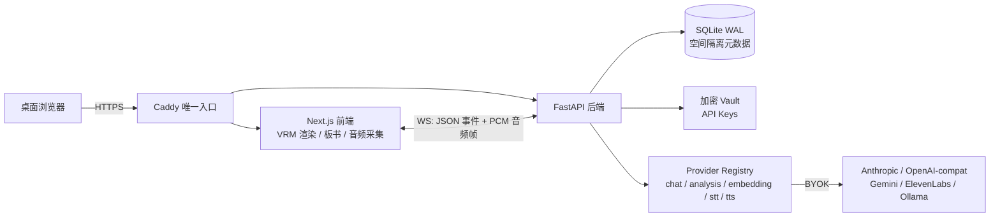

# Companion Space 发展与设计报告

> 面向项目所有者的战略文档，回答三个问题：这个项目要成为什么、它为什么这样设计、v0.1 之后往哪走。
> 执行层面的开发主线见 `docs/plan/v0.1-execution-plan.md`；竞争与素材调研原始数据见 `notes/opensource-research-2026-07.md`。
> 撰写日期：2026-07-30。

---

## 一、执行摘要

Companion Space 要做的事可以用一句话说清：**把"一对多的课堂"换成"一对一的二次元搭子"**——用户自建知识库、自带模型 Key、捏一个自己喜欢的角色，然后像视频通话一样和它对话学习；它因材施教、提供情绪价值、钻牛角尖时一步步带你梳理，必要时画图、做分步演示。

调研确认了三件事：

1. **市场空档真实存在。** GitHub 上 AI 伴侣阵营（AIRI 45.6k★ 等）和 AI 学习阵营（DeepTutor 31.2k★ 等）泾渭分明，没有人做"知识库 × 二次元角色 × 可打断语音通话 × 本地自托管"的交叉点。
2. **窗口期有限，约 6–12 个月。** 最大威胁 DeepTutor 与我们同栈同许可证、每日迭代。壁垒必须建在融合体验上，不能建在功能清单上。
3. **技术路径全部有据可依。** 捏人、口型、动作、素材许可都已核实到可执行的方案，没有需要发明的轮子，只有需要组装和打磨的体验。

当前状态：M0–M7 的本地代码与 Mock 闭环已经完成，Windows Docker 迁移、四态 VRMA、Character Card V2/V3、AIRI v0.11.3 ZIP 人格/内嵌 VRM 兼容、四状态本地 VRMA 覆盖管理、情绪驱动表情，以及指针/触控舞台凝视均已落地；版本仍是本地 release candidate，真实远程 Provider、物理音频设备、Desktop Edge 与 GitHub-hosted CI 证据尚未签核。

---

## 二、愿景与定位

### 2.1 我们在重塑什么

传统学习的三个结构性缺陷，对应本项目的三个设计回应：

| 传统学习的缺陷 | 我们的回应 |
| --- | --- |
| 一对多：老师无法照顾每个人的节奏 | 一对一通话式辅导，可打断、可追问、节奏由学习者控制 |
| 无情绪价值：挫败感没人接住，坚持靠意志力 | 角色人格与关系系统：搭子陪你学，而不是老师考你 |
| 知识与讲解脱节：讲义是死的，讲解是转瞬即逝的 | 个人知识库 + 可回溯引用 + 板书演示 + 复盘记忆，讲解沉淀为资产 |

### 2.2 定位声明

**给想掌控自己资料与模型的自学者的、本地自托管的二次元伴学空间。**

三个关键词的取舍：

- **"搭子"而非"老师"**：产品前台是可爱或 cool 的二次元专属搭子，不以老师自居。学习诊断、解释、追问和复习在后台自然发生。这是与所有 AI tutor 产品的根本气质区别，也是伴侣阵营用户能接受"顺便学习"的前提。
- **"本地"而非"云服务"**：数据主权是信任基石。资料、记忆、Key 全在用户机器上，Key 加密存储、音频不落盘、日志脱敏。开源 + 本地 = 用户敢把真实的学习资料和私人记忆交给它。
- **"留白"而非"内容"**：我们不提供课程、不预置学科。知识库是空的，角色是可捏的，模型是自带的——产品提供的是容器和体验，内容由用户填充。这让项目天然规避了内容生产的成本和监管风险，也让它适用于任何学科。

### 2.3 差异化与竞争策略

竞争格局（2026-07 核实）：

- **学习侧的 DeepTutor**（31.2k★，Apache-2.0，同栈）：学习功能几乎全覆盖，但无角色、无通话形态。**对策**：不和它拼 RAG 功能清单；凡重叠的学习功能（可视化、测验、引用回溯）直接复用其代码（许可证兼容），把自己的工程量集中在它没有的融合体验上。
- **伴侣侧的 AIRI / Open-LLM-VTuber**：形象与语音成熟，但定位是 VTuber/桌宠/角色扮演，社区文化离"学习"很远，短期无进入意愿。**对策**：兼容其生态（SillyTavern 角色卡规范、VRM 模型导入）而非对抗，把伴侣阵营的用户变成我们的角色包供给。
- **防御性壁垒的真正来源**（按重要性排序）：① 角色人格驱动的教学法（同一个知识点，毒舌前辈和温柔恋人讲法不同）；② 可打断的通话节奏（学习中"等一下我没懂"是高频动作）；③ 对话中即时画图演示；④ 角色包 + 学习空间的社区生态。

---

## 三、产品设计

### 3.1 核心体验：通话房间是产品的心脏

设计哲学：**不是"聊天软件加了个立绘"，而是"和角色待在同一个房间里学习"。** 一切界面围绕通话房间组织：

- 角色占据视觉中心，四态（idle/listening/thinking/speaking）让它"活着"；
- 板书区在角色旁边，讲到复杂处角色"转身画图"；
- 字幕、引用、临时笔记是通话的伴生物，不是独立功能；
- 结束通话进入复盘页——这一刻产品从"陪伴"切换到"学习资产沉淀"。

关键交互原则：

1. **打断优先于流畅。** 用户开口 250ms 内角色必须闭嘴。宁可牺牲播报完整性，不可让用户等待——"能随时打断"是通话感的本质，也是与播客式 AI 讲解的区别。
2. **失败降级有底。** 每个 AI 环节（STT/LLM/TTS/VRM/索引）都有确定性文字降级，任何单点失败不中断学习。
3. **引用不可伪造。** 所有引用由服务端从真实检索命中生成，模型无权自称"根据你的资料"。这是学习产品的诚信底线。

### 3.2 角色系统：人格是教学法的参数

角色不是皮肤，是教学行为的调制器：

- **人格四维**（温暖度/主动度/幽默度/挑战度）直接映射到教学策略：高挑战度角色会追问"那你说说为什么"，高温暖度角色会先接住情绪再讲题。
- **关系模型**（朋友/前辈/恋人/对手/自定义）决定称呼、语气和激励方式。
- **记忆系统是关系的载体**：角色记得你上周卡在哪里、你说过你考试的日期——记忆让"搭子"随时间变得不可替代。敏感个人记忆必须用户确认才进入长期记忆，这既是隐私设计也是关系设计（用户亲手决定"让它记住我什么"）。
- **成长性（v0.2+ 方向）**：关系随学习时长和里程碑演进（新认识→熟悉→默契），解锁称呼、表情和主动行为的变化。做成可感知但不做成氪金式数值。

### 3.3 学习闭环：后台严谨，前台自然

```
资料导入 → 索引 → 通话中检索引用 → 板书/演示 → 复盘摘要 → 记忆确认 → 复习项 → 下次通话自然带出
```

设计要点：

- **诊断不考试**：角色通过对话中的追问感知理解程度，而不是弹出测验框（测验作为可选功能存在，不是流程强制）。
- **复习自然发生**：复习项到期后，下次通话角色自然提起"上次那个问题，我们再过一遍？"——间隔重复的内核，搭子聊天的外壳。
- **演示是讲解的升维**：LessonScript（分步板书 + 逐步配音）让"讲不明白就画给你看"成为角色的本能动作，这是纯文字 AI 无法复制的体验。

### 3.4 信任与隐私设计

- 主密码 → Argon2id 派生密钥 → AES-256-GCM 加密 Key 库；明文只在已解锁的进程内存。
- 原始音频只存在内存，通话结束即消失；只保留最终字幕与摘要。
- 空间硬隔离：资料、记忆、会话、复习项、模型绑定不跨空间——"考研空间"和"日语空间"互相不知道对方存在。
- 检索内容作为不可信文本注入，资料里的指令不能改变系统行为。
- 成人关系模式默认关闭，仅本机拥有者确认 18+ 后开启，且始终服从模型供应商规则。

---

## 四、技术架构设计

### 4.1 架构总览



### 4.2 关键设计决策与理由

| 决策 | 理由 |
| --- | --- |
| BYOK + Provider 能力位（chat/analysis/embedding/stt/tts 按空间绑定） | 用户掌控成本与模型选择；能力位分离让"对话用快模型、演示脚本用强模型"成为可能 |
| SQLite WAL + 单进程后台队列，不引 Postgres/Redis/Celery | 单用户自托管场景下重依赖只会劝退用户；`docker compose up` 一条命令跑起来是硬指标 |
| 角色浏览器本地渲染（three-vrm），服务端不产视频流 | 零 GPU 服务器成本；"视频通话感"由前端状态机 + 口型 + 音频合成，而非真视频——这是本项目能单机自托管的关键取巧 |
| WebSocket 而非 WebRTC | 单机局域网场景延迟足够，复杂度低一个数量级；WebRTC 留给远期真正的远程场景 |
| 引用只由服务端生成 | 学习产品的可信性根基，同时是防幻觉的架构手段而非提示词手段 |
| 素材许可洁癖（内嵌 meta 逐个核实、THIRD_PARTY_NOTICES） | 开源项目的素材合规是一次性投入、终身资产；反面教材是被 DMCA 掉的形象类项目 |

### 4.3 为扩展预留的接缝

- **Provider Registry**：新模型厂商 = 新描述符 + 新客户端类，不动核心链路。
- **CharacterPack**：角色是自包含的 zip（配方 + 素材 + 许可清单），天然是社区分发单元。
- **RealtimeEvent 协议**：板书（`board.update`）已证明事件集可扩展；未来屏幕共享、白板协作走同一通道。
- **LessonScript**：演示脚本是结构化数据，天然可导出、可分享、可重放——它是未来"社区讲解库"的种子。

### 4.4 v0.1 之后的架构演进约束

以下内容只约束 v0.1 之后的演进，不改变当前 release candidate 的范围，也不表示相应能力已经实现。

**保持不动的主干：**

- 保留单会话 WebSocket + PCM/JSON、浏览器本地 VRM/2D 渲染、Provider Registry、RAG，以及敏感记忆确认后才进入长期状态的边界。
- 外部项目只用于帮助划清扩展接口，不重做现有实时链路；已有 STT/TTS Provider Registry 继续作为能力注册中心。
- 未来增加 avatar/output/synthesis adapter 时复用现有 registry 形状：编排层只面向契约，具体实现可以是浏览器 VRM/2D、Mock、本地进程、直连 WebSocket 或远端运行时。

**统一失效与原子打断：**

- 每轮引入单调递增的 `turn_id` 与 `generation_id`。用户 VAD 或手动打断时，当前 generation 整体失效。
- 同一次打断必须原子取消或失效 LLM 流、TTS 队列、未播放音频、口型 chunk 与动作/表情 chunk；渲染端只接受当前 generation，迟到结果直接丢弃。
- 后台返回的任何结果都必须校验 `session_id`、`turn_id` 与 `generation_id`，不能把旧轮次输出注入新轮次。

**Persona 与后台任务隔离：**

- 实时 PersonaAgent 只负责当前对话、少量人格卡、会话摘要和相关记忆检索；反思、研究、整理与长期记忆归纳放入异步后台 SubAgent。
- 后台任务必须定义取消、超时、幂等键和过期结果丢弃规则。任务完成不等于可以写回；写回前仍需通过会话版本与记忆确认边界。
- Persona、RAG 与长期记忆继续保持空间隔离，后台处理不得绕过跨空间访问限制。

**指标命名路线：**

| 指标 | 口径 |
| --- | --- |
| `submit_to_audio_scheduled_start_ms` | 用户提交到浏览器计划开始播放音频；明确这是 Web Audio 代理指标，不等同于扬声器实际出声 |
| `interrupt_to_playback_stopped_ms` | 用户打断到本地播放确认停止 |
| `interrupt_to_next_audio_start_ms` | 用户打断到下一 generation 首段音频开始播放 |
| `audio_to_mouth_motion_offset_ms` | 音频与当前 VRM/2D 口型运动的时间偏差；未来视频流另行定义 A/V offset |
| `avatar_fps` | 支持设备上的角色渲染帧率 |
| 角色约束违反率 | 回复违反角色知识、语言习惯、人格、信念或决策约束的比例 |
| 跨空间记忆泄漏率 | 当前空间响应出现其他空间记忆的比例 |
| 敏感候选未确认注入率 | 未经用户确认的敏感记忆候选进入上下文或长期状态的比例 |
| 删除后再注入率 | 已删除记忆再次进入上下文或回复的比例 |

历史文档中的 Mock 提交到计划播放 `<800ms`、插话后本地停播 `≤250ms`、支持设备角色 `≥30 FPS` 仍可作为目标口径，但不是本轮重新运行得到的新证据，不得在 release 说明中冒充 fresh evidence。

### 4.5 后续可选能力与证据边界

本节根据项目所有者提供的外部项目与论文调研摘要整理；本轮未重新拉取仓库、锁定 release/commit、运行上游实现或复现实验数字。链接用于后续 PoC 溯源，不构成本项目的已验证性能承诺。

| 来源 | 可吸收设计 | 边界 |
| --- | --- | --- |
| [OpenTalking](https://github.com/datascale-ai/opentalking) / [文档](https://datascale-ai.github.io/opentalking/latest/) | Orchestrator 与 Synthesis Backend 分离；先用 Mock 固化契约，再接 local/direct_ws/remote runtime | pre-1.0 项目；其自我定位与 roadmap 不能当作现成 SLA |
| [LiveTalking](https://github.com/lipku/LiveTalking) / [registry](https://raw.githubusercontent.com/lipku/LiveTalking/main/registry.py) / [功能说明](https://doc.livetalking.ai/docs/feature/) | avatar/output registry、多模型后端，以及 WebRTC、RTMP、虚拟摄像头等输出思路 | 安装文档与 README 的运行环境信息需在 PoC 前锁定 release/commit；网页互动阶段不引 RTMP |
| [CyberVerse](https://github.com/Lynpoint/CyberVerse) | 实时 PersonaAgent 与异步后台 SubAgent 分工，可替换 brain/voice/hearing/tools/memory/face | 一手资料未证明后台任务取消语义；GPL-3.0 代码不得直接并入当前 Apache-2.0 仓库，只做 clean-room 接口借鉴 |
| [MuseTalk](https://arxiv.org/abs/2410.10122) / [限制说明](https://github.com/TMElyralab/MuseTalk#limitations) | 未来可评估为 2D 音频口型 synthesis backend | 论文 FPS 是特定人脸区域与硬件上的生成吞吐，不是 STT→LLM→TTS→渲染全链路延迟；身份细节和逐帧抖动仍需实测 |
| [LivePortrait](https://arxiv.org/abs/2407.03168) | 高效 video-driven 肖像动画、stitching 与眼/唇 retargeting | 不是音频到实时对话视频的端到端方案 |
| [SentiAvatar](https://arxiv.org/abs/2604.02908) | 借鉴“句级语义计划 + 帧级韵律插补”的双时间尺度，让动作计划异步、口型与韵律走低延迟通道 | 论文中的动作生成吞吐不能外推为全链路时延，数据集代表性也需单独评估 |
| [Generative Agents](https://arxiv.org/abs/2304.03442) | observation→retrieval→reflection→planning 可启发长期记忆整理 | reflection/归纳应留在后台，实时轮次只取有限且相关的状态 |
| [Role-Playing Agents 综述](https://arxiv.org/abs/2404.18231) | 人格评测覆盖知识、语言习惯、人格、信念、决策及隐私/幻觉风险 | “能扮演”与“忠实于角色”必须分开验收 |
| [3D 交互综述](https://www.sciencedirect.com/science/article/pii/S1574013724000376) | 语音、目光、面部与姿态需要共享协调状态 | 不应拆成四条互不感知的生成链 |
| [中文数字人综述](https://cjig.cn/zh/article/doi/10.11834/jig.230649/) | 身份构建、头部动画、身体动画应按不同问题建模 | 不把“单图生成形象”“口型”“全身动作”混写为同一能力 |

WebRTC、MuseTalk/LivePortrait、服务端 talking-head 视频渲染、OBS/RTMP 与虚拟摄像头均属于 v0.1 之后的可选能力。只有出现远程通话、直播或桌面输出的明确需求时，才单独评估 ICE/TURN、UDP/防火墙、端到端打断状态机、GPU 预算和素材许可；当前 v0.1 不引入这些依赖。

### 4.6 后续集成的许可约束

- Companion Space、OpenTalking 与 LiveTalking 均按 Apache-2.0 方向评估；复用 Apache/MIT 代码仍须保留版权、许可证、NOTICE 和修改说明。
- CyberVerse 为 GPL-3.0。除非项目明确接受相应分发义务，否则只可 clean-room 借鉴思想与接口形状，不复制或改编其代码。
- 代码许可证不自动覆盖模型权重、InsightFace、MuseTalk 测试数据、声音样本、VRM/动作素材与云 API 条款；每类资产必须单独核验来源、用途、再分发和商业使用条件。
- 任一新 synthesis backend 进入仓库前，必须同时提交版本/commit 锁定、资源预算、失败降级、打断契约和第三方许可清单。

---

## 五、路线图

### v0.1 —— 跑通闭环（M0–M7 本地完成，外部验收待签核）

一句话目标：**全新克隆后，用 Mock 能走完全流程；用真实 Key 能完成"空间→资料→角色→通话→演示→复盘"。**
范围详见执行方案；此处不重复。

### v0.2 —— 补全体验（v0.1 发布后 2–3 个月）

主题：**把 v0.1 砍掉的还回来，把首版妥协的升级掉。**

- **手机局域网配对**（从 v0.1 移出的整块）：HTTPS + 一次性二维码 + 受信设备管理。躺床上和搭子通话是杀手场景。
- **捏人部件库扩容**：素材管线跑顺后扩充部件量；评估移植 CharacterStudio 的分文件部件方案。
- **口型升级**：RMS → wLipSync（MFCC 五元音），口型从"张嘴"进化到"说话"。
- **动作库扩展**：v0.1 已提前交付四态 CC0 VRMA 基础集、角色包动作导入，以及 `idle/listening/thinking/speaking` 四槽本地上传、替换和移除；v0.2 再增加打招呼、点头、庆祝等语义动作和更完整的创作者预览工具。
- **情绪演出升级**：v0.1 已提前交付 `CompanionTurn.emotion` → 安全 VRM/2D 表情联动，并保持 VRMA、眨眼和口型；v0.2 再补二元表情模型的可控策略、表情预览与更细的人格映射。
- **舞台交互（指针/触控凝视已提前交付）**：v0.1 已让 3D VRM 的真实 `VRMLookAt` 与 2D fallback 眼睛跟随主指针/触控，离开、取消、失焦和触控结束会回中；减少动态效果时保持静止。v0.2 再评估用户可控相机旋转、缩放和持久化舞台位置。
- **导入格式扩展**：DOCX、EPUB、网页剪藏；OCR 视工作量。
- **SillyTavern 角色卡兼容（已提前交付）**：Character Card V2/V3 独立 JSON 可导入为 CharacterPack 人格层；卡内提示词覆盖和远程资产不执行，保留本地安全边界的同时接入角色创作生态。
- **AIRI 角色卡 ZIP 兼容（VRM/Live2D/Spine + 会话级激活已提前交付）**：按 AIRI v0.11.3 固定源码契约读取 `manifest.json + card.json`；card-only 使用内置 VRM，VRM 经既有解析和元数据许可边界保存，Live2D/Spine 内层 ZIP 则经独立归档与引用校验后作为本地不可导出资产保存。后二者只通过部署者提供的同源、已许可 bridge 渲染；仓库不捆绑 Cubism Core、Spine Runtime 或上游角色资产，未配置时明确阻止形象而不影响文字会话。导入不会改写空间默认角色；用户可为下一次新会话显式选择角色，创建后由会话快照锁定。
- **测验与复习深化**：借 DeepTutor 的测验生成，包上搭子的壳（"考考你？"）。

### v0.3 —— 沉淀资产（再往后 3–4 个月）

主题：**让学习成果和角色关系变成可积累、可分享的东西。**

- **学习分析**：空间级的进度视图（学了什么、薄弱在哪、复习曲线），数据全本地。
- **演示导出**：LessonScript 导出为可分享的网页/视频文件——"我的搭子给我讲的这段，发给你看"是天然传播点。
- **关系成长系统**：3.2 节所述的可感知关系演进。
- **角色包社区机制**：官方 GitHub topic + 包索引仓库，社区免费分享角色包与部件（只做索引不做托管，规避审核负担）。
- **多模型协作**：慢路径（复盘/演示/记忆）与快路径（对话）自动分配不同模型的推荐配置。

### v1.0 —— 生态化（时机成熟时）

- 稳定的公开 API 与插件机制（自定义板书类型、自定义复习算法、外部工具接入）。
- 完整离线栈参考配置（Ollama + faster-whisper + 本地 TTS + BGE），"断网也能学"。
- 国际化（界面已中文优先，补英文/日文——VRM 生态的主场在日本）。

### 远期观察（不承诺）

- **AI 生成捏人**：StdGEN（Apache-2.0）等"单图→分层 3D 角色"方向一旦解决绑骨与 VRM 导出，捏人系统可升级为"上传一张图生成你的搭子"。持续跟踪，不押注。
- **XWear 格式**：VRoid Studio 2.0 的换装格式若出现开源 web 加载器，部件生态可直接接入 pixiv 官方管线。
- **情感语音**：TTS 厂商的情绪控制 API 成熟后，接入人格四维 → 语气的映射。
- **真实远程通话**：WebRTC + 云中继，那是产品走出单机的时刻，也是重新审视商业模式的时刻。

---

## 六、开源社区策略

- **发布即演示**：README 首屏放 30 秒通话+演示的 GIF/视频。这个项目是"看到就懂"型，文字介绍不如三秒画面。
- **零门槛试用**：Mock 全流程是获客功能不只是测试功能——没有 Key 的人也能完整体验产品形态。
- **角色包是增长飞轮**：创作者做角色包 → 用户为角色而来 → 用户变创作者。v0.1 的导入/导出、v0.3 的索引仓库都是为这个飞轮铺路。兼容 SillyTavern 卡是冷启动的捷径。
- **窗口期打法**：6–12 个月内目标不是功能全，而是**融合体验的不可替代性** + 社区心智占位（"想和二次元搭子一起学习 = Companion Space"）。发布节奏宁快勿全，v0.1 发布本身就是占位动作。
- **贡献者路径**：部件素材、角色包、Provider 适配器、翻译是四条低门槛贡献通道，都不需要理解核心架构。

---

## 七、风险与应对

| 风险 | 等级 | 应对 |
| --- | --- | --- |
| DeepTutor 补上形象/通话，抹平差异 | 高 | 不拼学习功能清单；专注融合体验；复用其代码降低自己的学习侧成本；快速发布占位 |
| 捏人部件素材供给不足（AI 无法产素材，依赖项目所有者制作/采购） | 高 | v0.1 已用内置整模兜底"开箱有好看角色"；部件库与开发并行准备；v0.2 开放社区部件贡献 |
| 单人项目节奏风险（v0.1 范围已因演示动画+完整捏人扩大） | 中高 | 里程碑门机制防烂尾；M0–M4 是可独立发布的最小内核，M5–M7 顺延不推翻 |
| 上游依赖变化（three-vrm、模型厂商 API） | 中 | three-vrm 由 pixiv 维护且刚发新版，风险低；Provider 抽象层隔离厂商 API 变动 |
| 合规（成人内容、未成年人、角色素材版权） | 中 | 成人模式默认关+18 确认；素材许可洁癖已制度化（THIRD_PARTY_NOTICES + 红线清单）；社区包只索引不托管 |
| 语音链路真实延迟不达预期（依赖第三方 API 网络） | 中 | 性能门只对 Mock 链路设硬指标；真实链路记录中位数不设硬 SLA；本地 STT/TTS 作为延迟兜底路线 |

---

## 八、成功指标

**v0.1 发布后 3 个月看：**

- 北极星：**周活跃通话时长**（不是安装量——搭子产品的成败在"回来找它"）。
- 生态早期信号：社区创建的角色包数量、被导入的自有 VRM 数量。
- 学习价值信号：复盘编辑率、记忆确认率、复习项完成率（这三个指标高，说明"顺便学习"真的发生了）。
- 工程健康：Issue 首响时间、全新克隆跑通率（每个 release 手测）。

**判断项目是否成立的一个朴素标准**：有用户在 Issue 里聊他的角色用了什么名字——当用户开始对角色产生叙事，产品就活了。
